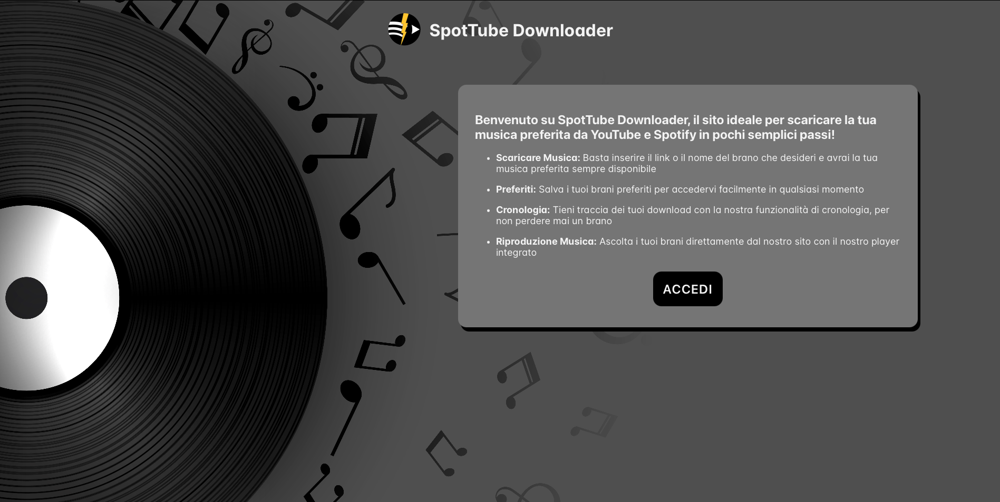
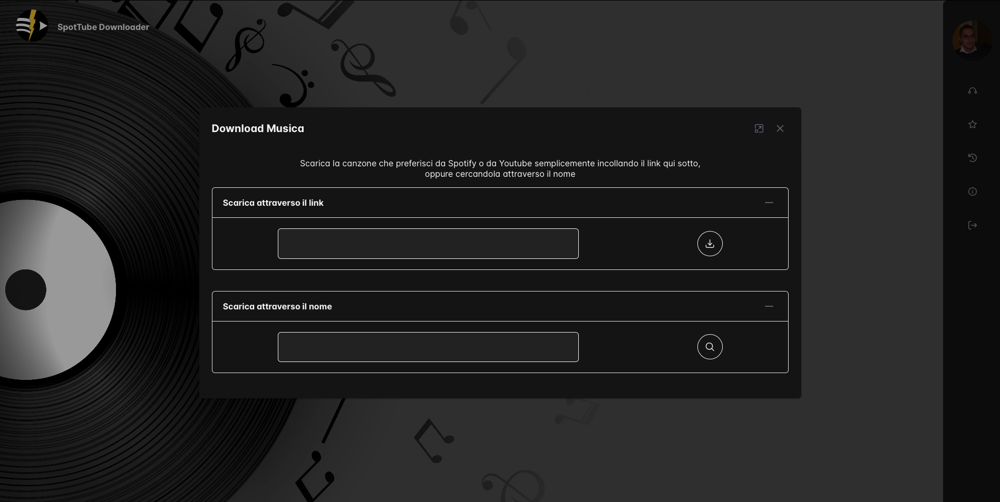
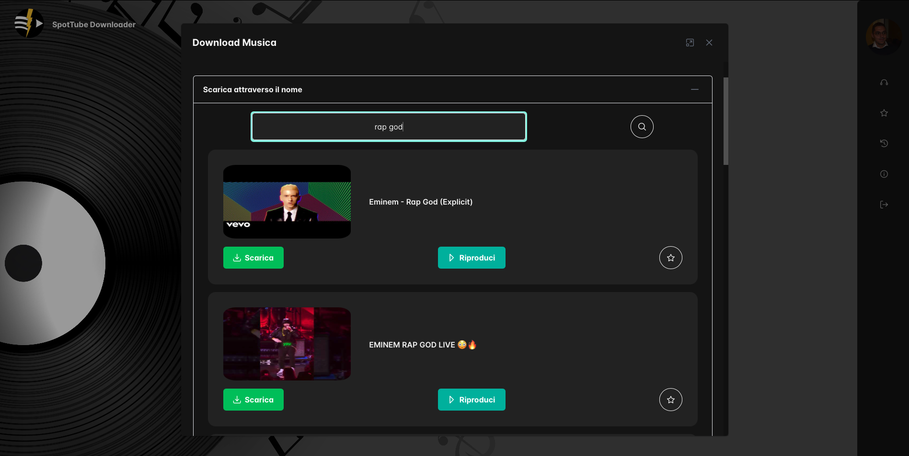
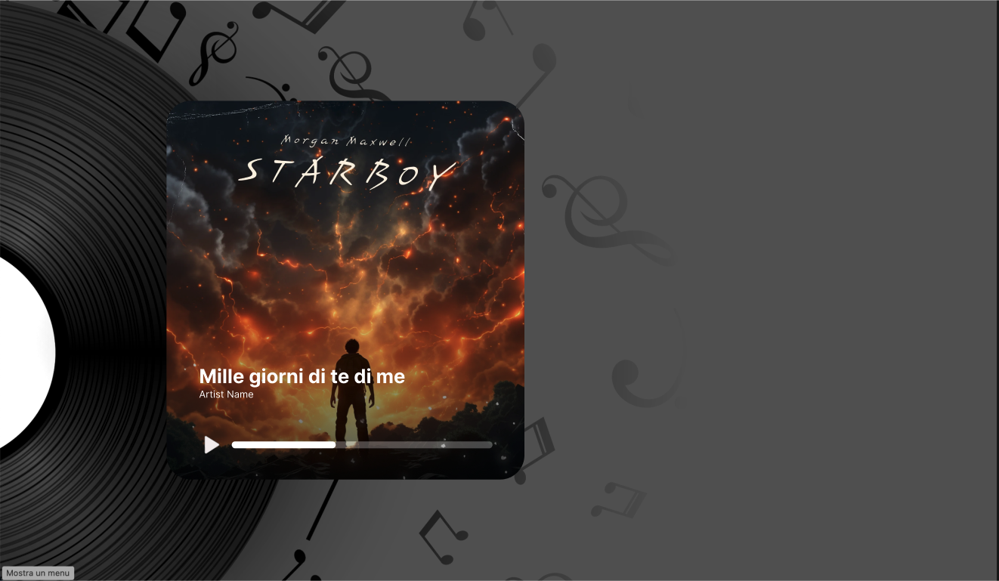

  

# SpotTube Frontend Documentation

This documentation describes the structure and components of the SpotTube frontend application, developed using React.

## Overview

The frontend is a Single Page Application (SPA) built using the React JavaScript library. It provides a modern user interface for downloading and playing music from Spotify and YouTube, interacting with the Node.js backend via REST APIs.

## Project Structure (Folders)

The frontend code is organized into several main folders for better readability and code separation:

### 1. `Components`

This folder contains all the React components used to build the user interface. It is further subdivided for organization:

* **`BasicsComponents`**: Contains fundamental, reusable components used across the application.
    * `LoginButton`: Implements user login using Auth0 functionalities.
    * `Navbar`: A vertical navigation bar with buttons for core features (Downloader, Favorites, History, Info, Logout). Clicking a button reveals the corresponding content area (box). Uses PrimeReact components.
    * `SearchLabel`: Combines an input label with a button for searching or downloading tracks.
    * `SongScroller`: A comprehensive component for displaying lists of songs. It includes callbacks for actions like deleting songs, playing them, adding to favorites, or adding to history. Used in Favorites, History, and potentially Info sections.
* **`Favorites`**: Components related to viewing, adding, or removing songs from the user's favorites list.
* **`History`**: Components for displaying and managing the user's listening history. Includes functionality (`AddHistoryByUserSub` endpoint interaction) to add songs to the history.
* **`Info`**: Contains components related to application information, including a `Rating` component for users to provide feedback.
* **`Music`**: Components for managing music search and display. Includes `SelectMusicLink` and `SelectMusicName` which likely act as scrollers/lists to display search results.
* **`Player`**: Contains all elements for audio playback, including play/pause buttons and a progress/seek slider.

### 2. `Context`

This folder manages the use of React Context for passing state or values between components without prop drilling. It is primarily used to ensure the music player functions correctly across different parts of the application.

### 3. `CSS`

Contains all CSS files and fonts for styling the application. Some components, like the Navbar and content boxes, utilize the PrimeReact component library for styling and structure.

### 4. `Page`

Contains the main page components of the application:

* `Home`: The main view after login. Includes the `Navbar` and the `Player`. The Player is initially hidden and appears only when playback is initiated.
* `Login`: The initial page for user authentication. Contains the `LoginButton` (using Auth0) and an informational box.

### 5. `Service`

This folder acts as a middleware layer, facilitating communication between the frontend components and the backend API. It is subdivided based on specific functionalities, mirroring the backend API structure:

* `Favorite`
* `History`
* `Music`
* `Rating`

These sub-folders contain functions to call the corresponding backend endpoints (e.g., fetching history, adding a favorite, searching for a song).

### Homepage

### Dashboard

### Core

